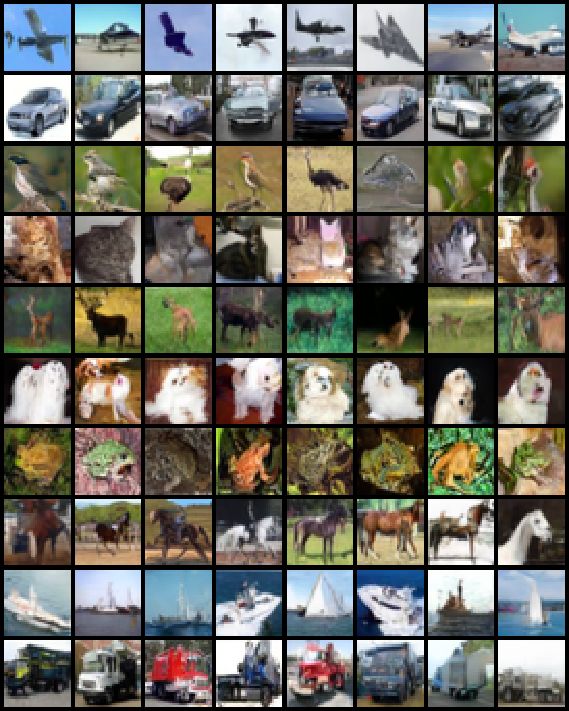
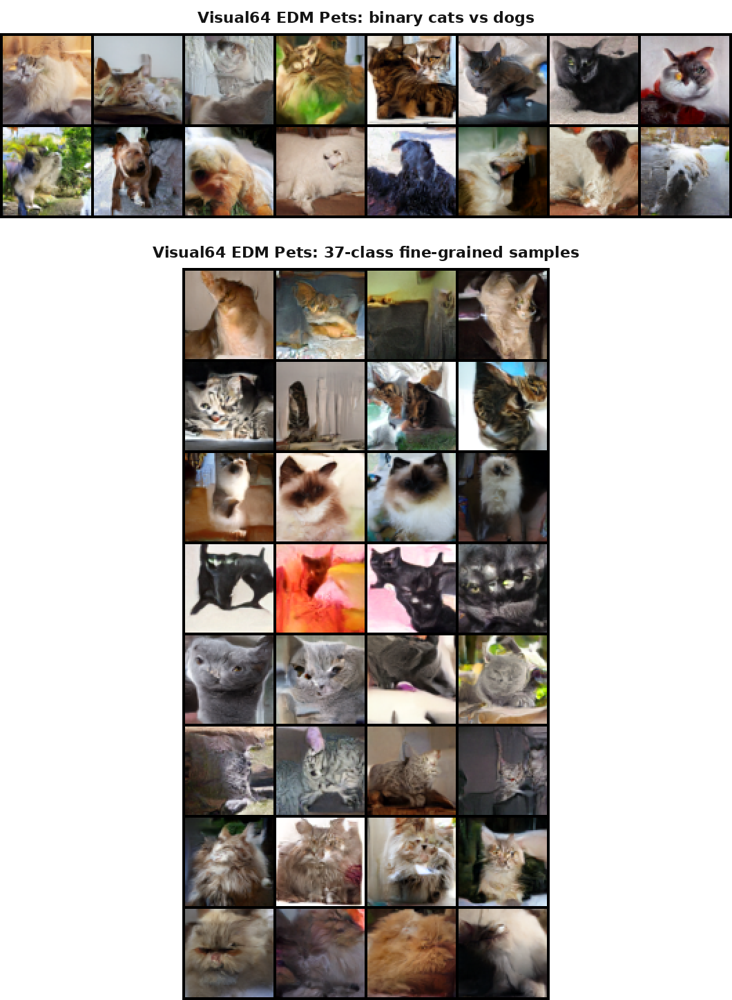

# RectifiedFlow-Lab

Class-conditional image generation experiments with Flow Matching, DDPM/DDIM, EDM, U-Net, Mini-DiT, and 64x64 visual extensions.

This repository started as a staged course project for diffusion and flow models. It now contains two connected parts:

1. A course-style lab sequence covering ODE/SDE probability paths, Flow Matching, DDPM, CFG, Mini-DiT, and discrete diffusion.
2. A showcase project that iteratively improves class-conditional image generation from CIFAR-10 Rectified Flow baselines to stronger DDPM/DDIM, EDM, and Visual64 results.

## Final Results

The strongest quantitative CIFAR-10 result is the cosine v-prediction U-Net trained with DDPM and sampled with DDIM:

| Result | Model | Sampler | Samples | FID | Inception Score |
| --- | --- | --- | ---: | ---: | ---: |
| CIFAR-10 final metric | U-Net DDPM, cosine, v-pred | DDIM 250, CFG 2.5 | 5k | 13.37 | 5.29 +/- 0.14 |



The clearest visual showcase is the Visual64 Pets EDM branch:



Key takeaways:

- Rectified Flow on CIFAR-10 is useful for studying velocity fields, ODE solvers, NFE, and guidance, but the early results were blurry.
- EMA, attention U-Net, longer training, time sampling, and loss weighting improved the Rectified Flow baseline but did not fully solve image sharpness.
- DDPM/DDIM with cosine schedule and v-prediction became the strongest CIFAR-10 quantitative baseline.
- EDM plus 64x64 Pets gave the best visual presentation.

## Repository Map

```text
src/
  flow_matching.py            # 2D Flow Matching objective
  diffusion.py                # DDPM utilities
  unet.py                     # MNIST conditional U-Net
  image_unet.py               # CIFAR/Visual U-Net backbone
  image_flow_matching.py      # image Rectified Flow loss
  image_flow_samplers.py      # Euler / Heun / CFG-like velocity sampling
  edm.py                      # EDM preconditioning and loss
  dit/                        # Mini-DiT from scratch

labs/
  lab1/                       # probability paths, ODE, SDE
  lab2/                       # 2D Flow Matching and DDPM
  lab4/                       # MNIST conditional DDPM + CFG
  lab5/                       # discrete diffusion toy lab
  lab_dit/                    # Mini-DiT MNIST lab
  lab_cifar_flow/             # CIFAR-10 FM, DDPM, EDM experiments
  lab_visual64/               # 64x64 Pets EDM experiments

configs/                      # reproducible experiment configs
figures/                      # generated figures and sample grids
results/                      # metrics, logs, runtime summaries
notes/                        # theory and experiment notes
reports/                      # longer experiment reports
```

## Course Labs

| Lab | Topic | Main Code | Representative Figure |
| --- | --- | --- | --- |
| Lab 1 | Probability paths, ODE, SDE | `src/ode.py`, `src/sde.py`, `labs/lab1/` | `figures/stage1/ode_trajectories.png` |
| Lab 2 | 2D Flow Matching | `src/flow_matching.py`, `src/samplers.py` | `figures/stage2/fm_samples_nfe_compare.png` |
| Lab 3 | DDPM and score-based sampling | `src/diffusion.py`, `labs/lab2/run_2d_ddpm.py` | `figures/stage3/ddpm_samples.png` |
| Lab 4 | MNIST CFG and architectures | `src/unet.py`, `src/cfg_sampler.py`, `labs/lab4/` | `figures/day4/cfg_scale_comparison.png` |
| Lab 4.5 | Mini-DiT | `src/dit/`, `labs/lab_dit/` | `figures/dit/unet_vs_dit_samples.png` |
| Lab 5 | Fast sampling and discrete diffusion | `src/discrete_diffusion.py`, `src/discrete_denoiser.py` | `figures/day5/final_unified_framework.png` |

## Showcase Project Progression

### Phase 1: CIFAR-10 U-Net Rectified Flow

Implemented class-conditional Rectified Flow:

```text
x0 ~ N(0, I), x1 ~ pdata
xt = (1 - t) x0 + t x1
v_theta(xt, t, y) ~= x1 - x0
```

Main files:

- `src/cifar10_dataset.py`
- `src/image_flow_matching.py`
- `src/image_unet.py`
- `src/image_flow_samplers.py`
- `labs/lab_cifar_flow/train_cifar10_unet_fm.py`
- `labs/lab_cifar_flow/sample_cifar10_fm.py`

### Phase 2: Sampling Analysis

Added NFE, solver, guidance, runtime, and memory ablations:

- `figures/cifar_flow/nfe_ablation_unet.png`
- `figures/cifar_flow/solver_ablation_unet.png`
- `figures/cifar_flow/guidance_ablation_unet.png`
- `figures/cifar_flow/runtime_vs_nfe.png`

### Phase 3: Rectified Flow Quality Upgrade

The first CIFAR-10 Flow Matching images were blurry. We added:

- EMA weights
- attention at 16x16 and 8x8
- longer training, 20 to 100 to 300 epochs
- beta time sampling and data-end loss weighting
- stronger configs such as `configs/cifar10_unet_fm_v2_large_ot_beta31_500ep.yaml`

These improved structure but did not reach the desired final visual quality.

### Phase 4: DDPM/DDIM Strong Baseline

To obtain a reliable high-quality CIFAR-10 baseline, the project moved to DDPM with cosine schedule and v-prediction:

- `labs/lab_cifar_flow/train_cifar10_ddpm_unet.py`
- `labs/lab_cifar_flow/sample_cifar10_ddpm.py`
- `labs/lab_cifar_flow/eval_cifar10_ddpm_metrics.py`
- `configs/cifar10_unet_ddpm_cosine_vpred_500ep.yaml`

Final metric:

```text
FID: 13.3722
Inception Score: 5.2858 +/- 0.1446
```

### Phase 5: EDM and Visual64

EDM was added for stronger preconditioning and Karras-style sampling:

- `src/edm.py`
- `labs/lab_cifar_flow/train_cifar10_edm_unet.py`
- `labs/lab_visual64/train_visual64_edm_unet.py`
- `labs/lab_visual64/sample_visual64_edm.py`

CIFAR-10 EDM improved over early EDM images but did not beat the DDPM/DDIM metric baseline. Visual64 Pets EDM became the strongest visual branch.

## Reproduction

Install dependencies:

```bash
pip install -r requirements.txt
```

Regenerate CIFAR-10 final DDPM/DDIM showcase:

```bash
conda run -n fm_diffusion python labs/lab_cifar_flow/sample_cifar10_ddpm.py \
  --config configs/cifar10_final_showcase_cosine_vpred_upscaled.yaml
```

Regenerate CIFAR-10 final metrics:

```bash
conda run -n fm_diffusion python labs/lab_cifar_flow/eval_cifar10_ddpm_metrics.py \
  --config configs/cifar10_metrics_final_cosine_vpred_5k.yaml
```

Regenerate Visual64 final panel:

```bash
python labs/lab_visual64/eval_visual64_sampling_sweep.py \
  --config configs/visual64_pets_binary_edm_sampling_300ep.yaml \
  --tag pets_binary \
  --class_ids 0 1 \
  --num_per_class 2 \
  --cfg_scales 1.0 1.5 2.0 3.0 \
  --num_steps_list 30 50 80

python labs/lab_visual64/eval_visual64_sampling_sweep.py \
  --config configs/visual64_pets_imagefolder_edm_sampling_300ep.yaml \
  --tag pets_37class \
  --class_ids 0 1 2 3 4 5 6 7 \
  --num_per_class 1 \
  --cfg_scales 1.0 1.5 2.0 3.0 \
  --num_steps_list 30 50 80

python labs/lab_visual64/make_final_visual64_showcase.py
```

## Documentation

- `PROJECT_COMPLETION.md`: final status and reproduction notes.
- `PROJECT_STAGE_SUMMARY.tex`: LaTeX stage summary with course labs and showcase project analysis.
- `reports/cifar10_flow_dit_report.md`: CIFAR-10 Flow Matching report scaffold.
- `notes/cifar10_quality_debug.md`: quality-debug notes for the Rectified Flow branch.
- `notes/solver_nfe_analysis.md`: NFE, solver, and guidance analysis.

## Current Conclusion

The final project demonstrates the complete path from theory labs to usable image generation experiments. The best quantitative CIFAR-10 result is DDPM/DDIM cosine v-prediction, while the best visual result is Visual64 Pets EDM. Rectified Flow remains valuable as the main conceptual bridge for probability paths, velocity fields, ODE sampling, NFE, and guidance analysis.
