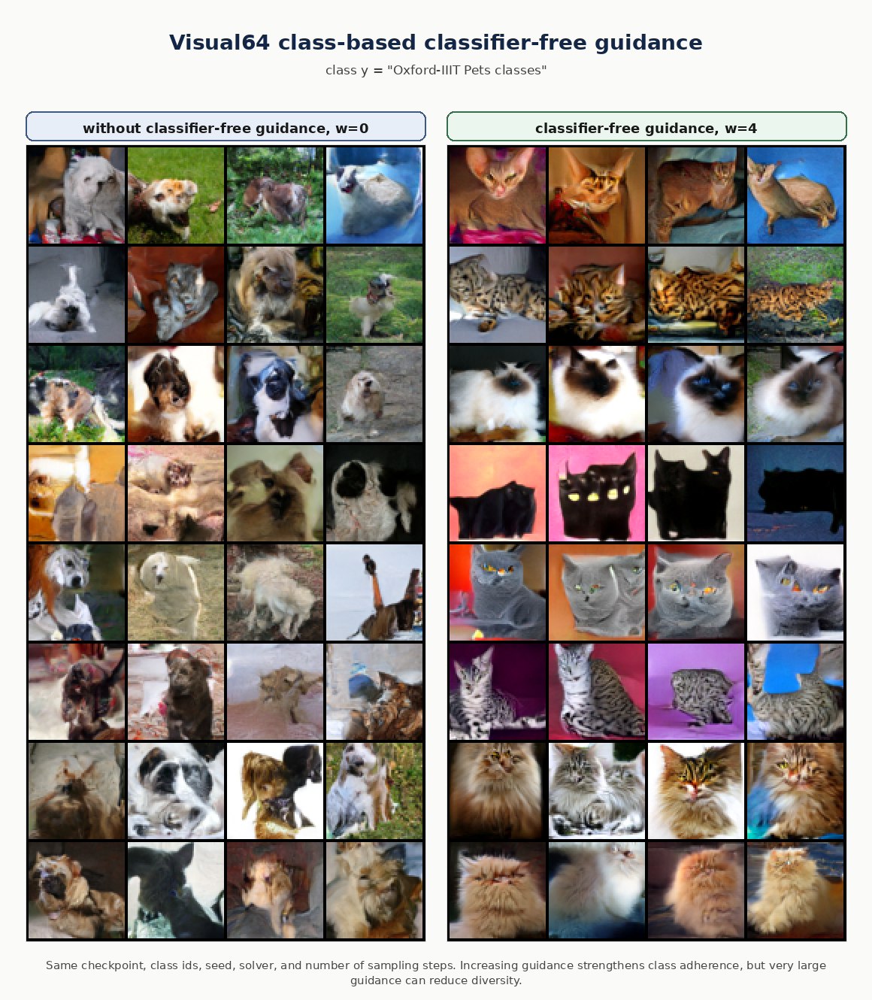

# Visual64 Classifier-Free Guidance Comparison

## Goal

This experiment completes Stage 8A: a small Figure-11-style reproduction of class-based classifier-free guidance before moving to ImageNet-128.

The setup fixes the checkpoint, class ids, random seed, sampler, and number of sampling steps, then compares:

```text
left:  cfg_scale = 0
right: cfg_scale = 4
```

The purpose is not to claim ImageNet-128 performance yet. The purpose is to validate the full comparison workflow that will later be reused for ImageNet-128 class-based CFG.

## Setup

```text
checkpoint: checkpoints/visual64_pets_imagefolder_unet_edm_300ep.pt
config: configs/visual64_pets_imagefolder_edm_sampling_300ep.yaml
dataset branch: Oxford-IIIT Pets ImageFolder, 64x64
model: class-conditional EDM U-Net
weights: EMA
sampler: EDM Heun
steps: 80
seed: 123
class ids: 0 1 2 3 4 5 6 7
num_per_class: 4
cfg scales: 0.0 and 4.0
```

## Result



Output files:

```text
figures/visual64/sampling_sweep/pets_cfg_figure/pets_cfg_figure_steps80_cfg0.png
figures/visual64/sampling_sweep/pets_cfg_figure/pets_cfg_figure_steps80_cfg4.png
figures/visual64/cfg_w0_vs_w4_panel.png
results/visual64/sampling_sweep/pets_cfg_figure_sampling_sweep.json
results/visual64/cfg_w0_vs_w4_panel.json
```

## Analysis

The `w=0` side is weakly conditioned. It keeps more variation across samples, but the generated images are less tightly aligned with the requested class ids.

The `w=4` side shows stronger class adherence. The generated samples become more visually concentrated around the target pet classes, especially in repeated texture, color, and head/body structure. This matches the expected CFG behavior:

```text
prediction = prediction_uncond + w * (prediction_cond - prediction_uncond)
```

The trade-off is also visible: stronger guidance can reduce diversity and may amplify class-specific texture patterns. Therefore, `w=4` is useful for a Figure-11-style class-adherence demonstration, but a scale sweep is still needed when reporting final quality.

## Difficulties and Resolution

The current execution environment did not expose a usable CUDA device:

```text
torch.cuda.is_available() = False
nvidia-smi could not communicate with the NVIDIA driver
```

To finish Stage 8A anyway, the required Visual64 EDM samples were generated on CPU. This is slower but keeps the exact same checkpoint, sampler, seed, class ids, and guidance scales. Future larger ImageNet-128 experiments should be run on GPU.

## Reproduction Commands

Generate the two guidance settings:

```bash
python labs/lab_visual64/eval_visual64_sampling_sweep.py \
  --config configs/visual64_pets_imagefolder_edm_sampling_300ep.yaml \
  --tag pets_cfg_figure \
  --class_ids 0 1 2 3 4 5 6 7 \
  --num_per_class 4 \
  --cfg_scales 0.0 4.0 \
  --num_steps_list 80 \
  --seed 123 \
  --device cuda
```

If CUDA is not available, replace `--device cuda` with `--device cpu`.

Build the Figure-11-style panel:

```bash
python labs/lab_visual64/make_cfg_comparison_panel.py \
  --left figures/visual64/sampling_sweep/pets_cfg_figure/pets_cfg_figure_steps80_cfg0.png \
  --right figures/visual64/sampling_sweep/pets_cfg_figure/pets_cfg_figure_steps80_cfg4.png \
  --class_name "Oxford-IIIT Pets classes" \
  --left_title "without classifier-free guidance, w=0" \
  --right_title "classifier-free guidance, w=4" \
  --save_path figures/visual64/cfg_w0_vs_w4_panel.png \
  --metadata_out results/visual64/cfg_w0_vs_w4_panel.json
```

## Conclusion

Stage 8A is complete. The repository now has a reproducible small-scale Figure-11-style CFG comparison. The next step is Stage 8B: generalizing the training and sampling code for `image_size=128` and larger `num_classes`, preparing for ImageNet-128 subset experiments.
